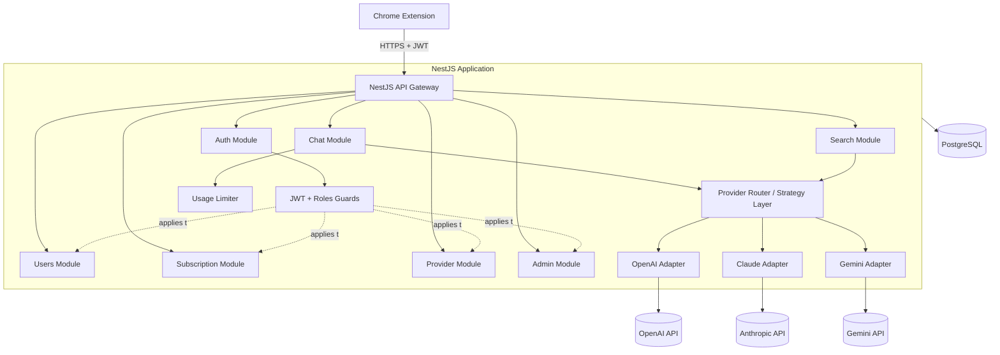
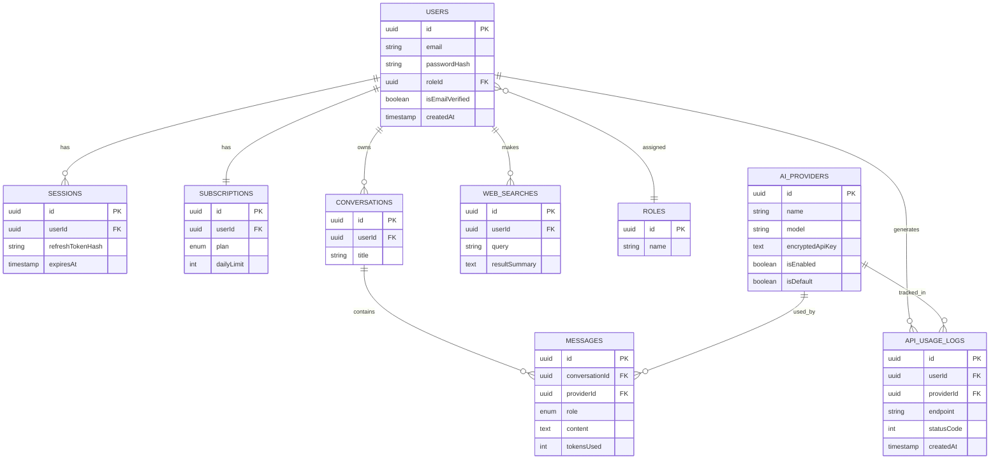

# EchoGPT Backend — System Design

## 1. High-Level Architecture



## 2. Core Design Principle: Strategy/Adapter Pattern for Providers

Instead of branching logic per provider, one contract is shared across all AI providers:

```typescript
interface AIProviderAdapter {
  sendMessage(messages: ChatMessage[], apiKey: string, model: string): Promise<AIResponse>;
  healthCheck(apiKey: string, model: string): Promise<HealthStatus>;
}
```

`OpenAIAdapter`, `ClaudeAdapter`, and `GeminiAdapter` each implement this interface independently. A `ProviderRegistryService` resolves the correct adapter by name at runtime. Adding a fourth provider in the future means writing one new class — nothing else in the codebase needs to change.

## 3. Module Breakdown

| Module | Responsibility |
|---|---|
| `AuthModule` | Register, login, refresh, logout, email verification |
| `UsersModule` | Profile, roles, account deletion |
| `SubscriptionModule` | Plans, usage limits |
| `ProviderModule` | CRUD on AI providers, encrypted keys, health checks |
| `ChatModule` | Send prompt, streaming, conversation history |
| `SearchModule` | Web search, history, suggestions, caching |
| `AdminModule` | Dashboard, analytics, logs, system health |
| `CommonModule` | Shared guards, filters, decorators |

## 4. Database Design (Entities & Relations)



## 5. Relationship Reference

| Relationship | Type | FK location |
|---|---|---|
| roles → users | 1:N | users.roleId |
| users → sessions | 1:N | sessions.userId |
| users → subscriptions | 1:1 | subscriptions.userId (unique) |
| users → conversations | 1:N | conversations.userId |
| conversations → messages | 1:N | messages.conversationId |
| ai_providers → messages | 1:N | messages.providerId (nullable) |
| users → web_searches | 1:N | web_searches.userId |
| users → api_usage_logs | 1:N | api_usage_logs.userId |
| ai_providers → api_usage_logs | 1:N | api_usage_logs.providerId (nullable) |

## 6. Key Flows

**Auth (access + refresh token):**

```
Login → verify password → issue access token (15m) + refresh token (7d, hashed in Sessions)
Access token expires → client calls /auth/refresh
  → server checks hash match + expiry → issues new pair, rotates the session row
Logout → delete session row → refresh token is now useless even if stolen
```

**Chat request:**

```
POST /chat → JwtGuard → check daily usage limit
  → ProviderRegistryService resolves adapter (requested provider or default)
  → decrypt key → adapter.sendMessage() → catch provider errors gracefully
  → save Message rows → write ApiUsageLog → return response
```

## 7. Design Trade-offs

- **Global providers, admin-managed** — not per-user API keys, to keep key management centralized and auditable.
- **Refresh tokens as hashed random bytes**, not JWTs — allows real server-side revocation, unlike a stateless JWT refresh token.
- **In-memory search cache** instead of Redis — simpler for this project's scope, documented here as a clear production upgrade path.
- **Streaming implemented natively for OpenAI only** — Claude and Gemini adapters fall back to returning a single full-response chunk.
- **Docker was intentionally skipped** for this submission; the app runs directly against a cloud-hosted PostgreSQL instance (Neon).